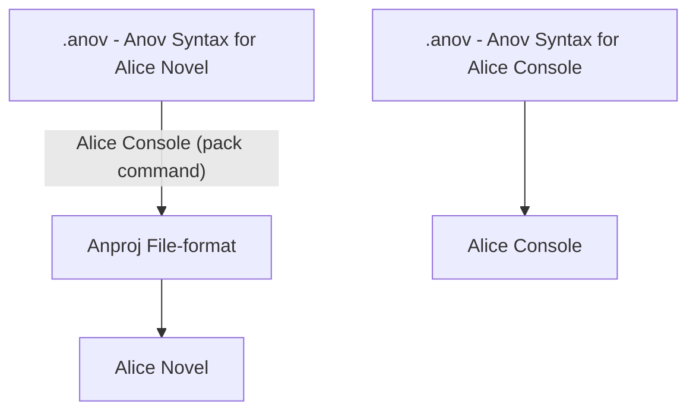
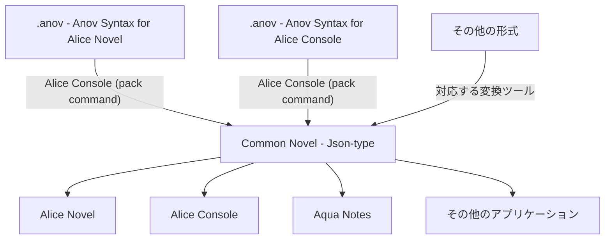

本資料は、4月末に作成した"[2025年4月指針](../0426)/2025Q2"を大幅に改定し、2025年6月指針として今後の短期基本計画について記載します。(変更前の文章は~~打ち消し線~~を加えています)

なお、この計画は参考程度であり、状況に応じて変更を行います。

## 今期の計画

### 時期

> ~~2025年5月-7月~~

2025年6月

### 基本計画

#### LRA 本部

- Lemonium (Website)  
気が向いたらデザインの向上をします。

#### Alice Project

2023年から継続して開発しているゲーム関連インフラです。

- Alice Novel
- Alice Console
- Anov LSE / Anov Syntax Extension
- commonnovel-spec

> ~~Spec の制定と、それに対応させることを優先させたいです。~~
> 
> ~~Alice Novel に関しては、機能実装を進めても面白いかもしれません。~~

Alice Novel については、5月末に Microsoft Store にて v0.9.3 が公式リリースされました。v0.9.4 の開発もかなり進んでいるため、これのリリースを早期に対応する予定です。その次のバージョン v0.9.5 では、大規模なリファクタリング、現在の Anproj + Anov for Alice Novel 形式から、後述する commonnovel-spec v0.1.0 で制定した仕様に合わせる予定です。

Alice Console に関しては、Alice Novel と同様に、commonnovel-spec v0.1.0 に適合させることと、`test` (1節に同じ命令が2つ被っている場合に警告) や `format`(命令が1つもない節 (改行) を削除、不要なスペースの削除) などのコマンド実装を考えています。

今までの考えとしては、Anov Syntax for Alice Novel と Anov Syntax for Alice Console の仕様を統一化して Common Novel とし、細かい部分については Flavor (イメージとしては [MFM](https://misskey-hub.net/docs/for-users/features/mfm/)、[GFM](https://github.github.com/gfm/)、[GLFM](https://docs.gitlab.com/user/markdown/) など) としてアプリケーションごとの個別仕様として定義するつもりでした。(ここでは、"旧 Common Novel 方式"とする)

しかし、Anov Syntax の仕様は、1節ずつ読み込むという特殊方式であり、あまり一般化に向いていません。

そこで、`.ipynb` (Jupyter Notebook) 形式のように、Json を利用する方式を考えました。(ここでは、"新 Common Novel 方式/Common Novel - Json 方式"とします)

これの利用方法としては、今まで通り Anov Syntax で書いた `.anov` ファイルを、Alice Console などで `.an` (`.ns` (Novel Script)?) 形式に変換し、それを Alice Novel や Alice Console、Aqua Notesで読み込むという方式です。(C# を IL に変換するみたいな形です)

今まで:


これから:


結論として、
- Common Novel は Advanced Novel (Anov Syntax) を置き換えるものではない
- Common Novel は Advanced Novel (Anov Syntax) の**処理**を合理化・高速化するための開発方針
- Common Novel の処理系は今まで (Advanced Novel (Anov Syntax)) とはかなり異なる
- 今までは Alice Novel、Alice Console、Aqua Notes では Anov Syntax 自体を直接読み込んでいたが、これからはCommon Novel に切り替え、読み込みの処理速度改善と、汎用性・冗長性の上昇を目指す

なお、具体的な構文は、`.ipynb` (Jupyter Notebook) 形式を参考にしていますが、`metadata` 項目はなく、今までの `package.json` を `config.json` として管理する予定です。例を以下に表示します:

以前の Anov 形式:
```anov
> green-park.png
- Alice
[Hi, there.]

- Rabbit
[Hi, Alice.]

[Nice to meet you.]

```

新 Common Novel 形式:
```json
{
  "cells": [
    {
      "lines": 1,
      "characrter-name": "Alice",
//    "character-image": "",
      "background-image": "green-park.png",
      "messages": "Hi, there."
    },
    {
      "lines": 2,
      "characrter-name": "Rabbit",
      "background-image": "green-park.png",
      "messages": "Hi, Alice."
    },
    {
      "lines": 3,
      "characrter-name": "Rabbit",
      "background-image": "green-park.png",
      "messages": "Nice to meet you."
    }
  ]
}
```

画像をまとめる、拡張性のためにプラグイン (または Extension) 要素を追加する、分岐のためのフラグを用意するなども考えられます:
```json
{
  "cells": [
    {
      "lines": 1,
      "characrter-name": "Alice",
      // 画像をまとめる
      "image": {
        "frontground": "alice-normal.png",
        "background": "green-park.png"
      },
      "messages": "Hi, there."
    },
    {
      "lines": 2,
      "characrter-name": "",
      "image": {
        "background-image": "frutiger-aero.png"
      },
      "messages": "Let's search!",
      // プラグイン専用要素 (プラグインの性質によって config.json などで設定してもいいかも)
      "plugin": [
        {
          "name": "aliceproject-search.dll",
          "search-engine": "google"
        },
        {
          "name": "aliceproject-compression.dll",
          "image": "image/webp",
          "audio": "none",
          "video": "video/webm"
        }
      ]
    },
    {
      "lines": 3,
      "characrter-name": "Rabbit",
      // 選択
      "selection": {
        "apple": "",
        "lemon": "",
        "grape": ""
      },
      "image": {
        "froutground-image": "fruits.png"
      },
      "messages": "Select fruit you like."
    },
    {
      "lines": 4,
      "characrter-name": "Rabbit",
      // 分岐 ("または"と"かつ" (AND, OR, XOR) をどのようにするかは微妙)
      // 当てはまる場合は、この行を表示、当てはまらない場合はスキップされる
      "if": {
        "apple": "true",
        "lemon": "false",
        "fruits": 2
      },
      "image": {
        "background-image": "green-park.png"
      },
      "messages": "Nice to meet you."
    }
  ]
}
```

Alice Novel 向けのゲーム作成についても考えています。しかし、これについては Ivy Cafeteria ですでに SRFB の開発計画があるため、こちらの完成を考えたほうが良いかもしれません。(というか、現状はそのつもりです)

#### Ivy Cafeteria

- LynnePG  
> グラフィックを頑張りましょう。リリース目指します。

グラフィックに関しては、ノーマルマップ/法線マップを利用し、光の方向によってキャラクターやオブジェクトの色を変化と、豊かな影の表現を行いたいです。…が、その前にある程度遊べるくらいまで機能を進化させたいですね…。

コンセプトイラストの作成も考えています。リリースを目標として頑張りたいですね。

- AkizukiForest  
気が向いたらシナリオを刷新して、v2.0.0 をリリースするかもしれません。配布方式をもう少しわかり易くしたほうがいいかな。

- Medicolor  
先述の通り、開発を継続するかどうかは不明です。するとしたら、色覚異常のレベルを10段階 (論文で登場する数値が10段階) で変更できるとか、それ以上細かい数値を近似で求めるとか。あとは、GUI 化するとか。

#### 外部

- .NET MAUI / maui-linux
   > ~~がんばります。(使命感)~~

   8月1日締切の Nlnet 基金に申し込み、資金調達を行う予定です。おそらく技術力不足から却下されると思いますが、この申し込みを1つの目標とすることで、私自身の技術力強化と、maui-linux の開発促進することを期待しています。まずは、事前準備として、要請資料の作成と、それに向けた機能実装の PR (Pull Request / 自己 PR) を進める予定です。最近のリポジトリの稼働率からして、おそらく PR の Review にかなりの時間を要すると思うので、6月の早期から PR (Pull Request) することを考えています。可能性は低いですが、正式に Nlnet のプロジェクトとして採択された場合は、8月以降の数ヶ月 (最低2ヶ月) にわたって、LRA の集中特別計画に確定します。

- KDE
   > ~~日本語翻訳、KDE neon の日本語対応パッチ、日本でのローカルイベント (ユーザーサポート) など考えていますが、どれをやるかはわかりません。なんかしらで KDE に貢献できたら良いと考えています。~~
   - 日本語翻訳  
   5月の最終日に、[krita.org の日本語翻訳を更新](https://mail.kde.org/pipermail/kde-jp/2025-May/001779.html)しました。今後も、できる限り翻訳を進めていく予定です。
   - 資料作成  
   [日本語版 Planet KDE](https://misskey.io/notes/a8h5vdssrj0p0dsz) の稼働を開始しました。かなり前 (2024年2月と、1年以上前!) に [Planet KDE の日本語翻訳](https://mail.kde.org/pipermail/kde-jp/2024-February/001605.html)を行い、今回で資料の追加を起こったことで、ついに稼働開始し始めたという形です。今後も、記事の作成を続けていく予定です!
   - KDE neon 日本語対応パッチ  
   6月末までにちゃんと利用できるかを確認し、正式に日本コミュニティーで公開する予定です。(願望) ただ、KDE neon のメンテナーに連絡を取るかどうかは微妙です。
   - 日本でのローカルイベント  
   現時点は特に考えていません。
   - 開発協力  
   特に予定はありません。日本 KDE のウェブサイトを Hugo にできないか、以前に試したことがあるのですが、KDE 公式のテーマを利用すると、自動的に英語ページが作成されてしまうので、以降作業は難しそうだと思っています。
   - 動画作成  
   KDE の広報活動として、動画作成をすることも考えています。が、動画作成はかなり時間がかかるので、あまり前向きではありません…。これの妥協案として、先述した記事を作成している、というわけでもあります。
   - その他  
   SNS とかに関しては、他の方にお任せするつもりです。

### 最後に

> ~~計画とか言っているくせに、結構適当な気がする…。~~

計画をかなり書き換えたので、価値のある指針となったと思います。

作業内容が多く、おそらく6月中には終わらない部分もあると思います。終わらなかった内容については、次期中間基本計画 (2025Q3) に引き継ぎ、計画を継続する予定です。
