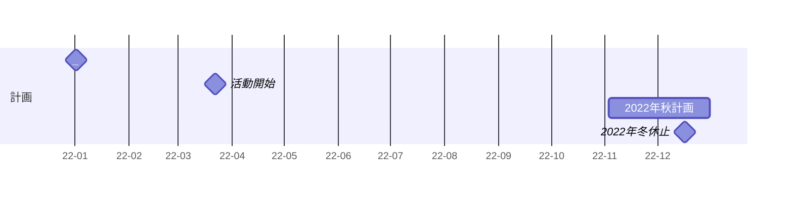
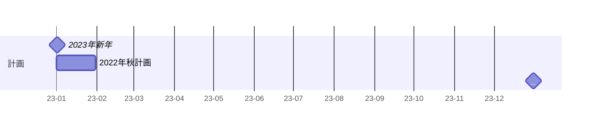
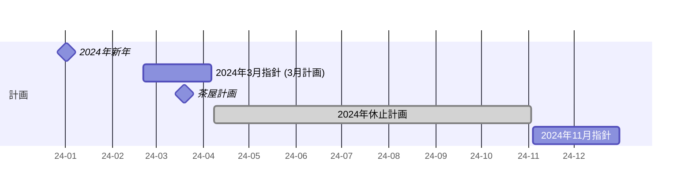
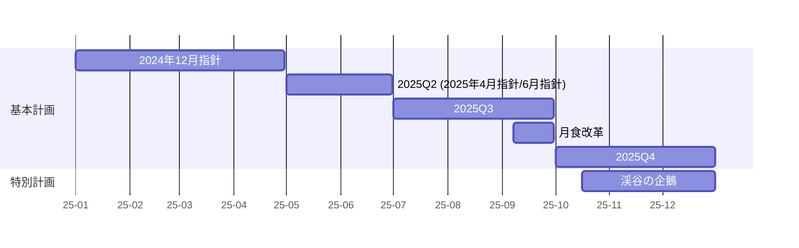

# 組織計画の歴史

### 2022

```mermaid
gantt

dateFormat YYYY-MM-DD
axisFormat %y-%m

section 計画
  _:            milestone,  00, 2022-01-01, 1d
  活動開始:     milestone,  01, 2022-03-22, 1d
  2022年秋計画:             q3, 2022-11-03, 2022-12-31
  2022年冬休止: milestone,  q4, 2022-12-16, 1d
```

### 2023

```mermaid
gantt

dateFormat YYYY-MM-DD
axisFormat %y-%m

section 計画
  2023年新年:   milestone,  01, 2023-01-01, 1d
  2022年秋計画:             q1, 2023-01-01, 2023-01-31
  _:            milestone,  99, 2023-12-31, 1h
```

### 2024

```mermaid
gantt

dateFormat YYYY-MM-DD
axisFormat %y-%m

section 計画
  2024年新年:       milestone,  01,     2024-01-01, 1d
  2024年3月指針 (3月計画):      q1,     2024-02-21, 2024-04-06
  茶屋計画:         milestone,  cafe,   2024-03-19, 1d
  2024年休止計画:   done,       rest,   2024-04-08, 2024-11-03
  2024年11月指針:               q4,     2024-11-04, 2024-12-31
```

### 2025

```mermaid
gantt

dateFormat YYYY-MM-DD
axisFormat %y-%m

section 基本計画
  2024年12月指針:                   q1,     2025-01-01, 2025-04-30
  2025Q2 (2025年4月指針/6月指針):   q2,     2025-05-01, 2025-06-30
  2025Q3:                           q3,     2025-07-01, 2025-09-30
  月食改革:                         luna,   2025-09-07, 2025-09-30
  2025Q4:                           q4,     2025-10-01, 2025-12-31

section 特別計画
  渓谷の企鵝: gulch,  2025-10-16, 2025-12-31
```
