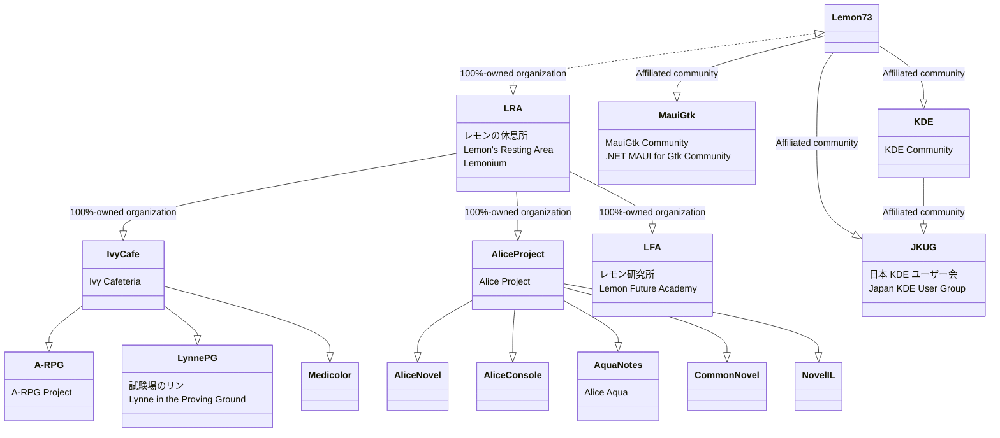

# 組織関係図

LRA 内部の組織体制、及び外部との関係性について示した図です。

一部の組織 (月計画などの規模の小さい組織) は省略しています。

```mermaid
classDiagram
  LRA : レモンの休息所
  LRA : Lemon's Resting Area
  LRA : Lemonium
  AliceProject : Alice Project
  IvyCafe : Ivy Cafeteria
  LFA : レモン研究所
  LFA : Lemon Future Academy

  MauiGtk : MauiGtk Community
  MauiGtk : .NET MAUI for Gtk Community
  KDE : KDE Community
  JKUG : 日本 KDE ユーザー会
  JKUG : Japan KDE User Group

  Lemon73 --|> MauiGtk : Affiliated community
  Lemon73 --|> KDE : Affiliated community
  Lemon73 --|> JKUG : Affiliated community
  KDE --|> JKUG : Affiliated community

  Lemon73 <|..|> LRA : 100%-owned organization
  LRA --|> IvyCafe : 100%-owned organization
  LRA --|> AliceProject : 100%-owned organization
  LRA --|> LFA : 100%-owned organization

  AquaNotes : Alice Aqua

  AliceProject --|> AliceNovel
  AliceProject --|> AliceConsole
  AliceProject --|> AquaNotes
  AliceProject --|> CommonNovel
  AliceProject --|> NovelIL

  A-RPG : A-RPG Project
  LynnePG : 試験場のリン
  LynnePG : Lynne in the Proving Ground

  IvyCafe --|> A-RPG
  IvyCafe --|> LynnePG
  IvyCafe --|> Medicolor
```
