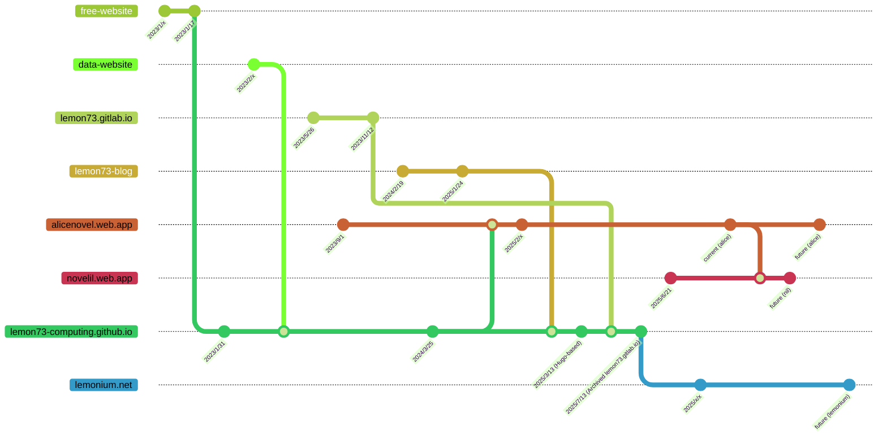

# ウェブサイトの歴史

旧 LEC 及び、LRA 系列のウェブサイトの歴史に関して記載します。

(日付は大体です。Git の履歴をもとにしていますが、昔はコミットとデプロイするタイミングが異なるため、正確な日付ではない可能性が高いです)

(`free-website` was `lec.starfree.jp`, `data-website` is `http://lemonfuture.s239.xrea.com`, `lemon73-blog` was `lemon73-computing.github.io/blog`)
